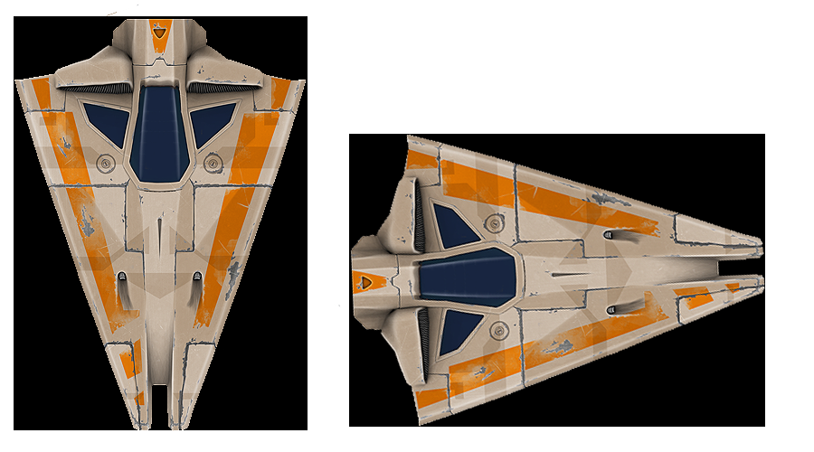

# Asteroids by Lyneia
A Unity3D game made by Lyneia as work test for a game studio. The project was based on Asteroids (1979) and had to be made without Unity's Physics

## Description

The game is based on Asteroids from 1979 with simplified rules and "modern" visuals.

## NTFAQ - Not That Frequently Asked Questions
### Why 3D Graphics over 2D Sprites ?
First because I had 3D space shooter assets from a previous project and secondly because I tend to prefer to use 3D (or 3D looks such as Isometric) in my projects. But the game is still working in 2D environment.

### Why Separating Axis Theorem (SAT) over Axis-Aligned Bounding Box (AABB) ?
My first idea was to use polyhedra for the asteroids or the player and so AABB won't have worked. A way to have AABB work is to put objects in an aligned cube but the downside of this is to recalculate parent's bounding box each time the child rotates.

### How to improve the state of the game ?
The game can be improve with a few thing:
- Use Unity's Physics instead of own implementation of collision and gameobjects's movement
- If we don't use Physics, performed broad and narrow phase, for example with quadtree to improve collision management (less collision to check each update)
- Make the game resizeable
- Improve code management
- Get Users feedback and adapt what's needed

### How long did you work on the project ?
Between 18 and 22 hours including the documentation phase.

## Credits

### Assets
Most of the assets belong to Unity Technology, there were given as example for an old tutorial. (Particle systems weren't made by me)

### Sounds
In Game music by Anthox Colaboy : https://soundcloud.com/Anthox-colaboy

### References
SAT explanation https://dyn4j.org/2010/01/sat/

Usefull reading  https://www.geometrictools.com/Documentation/DynamicCollisionDetection.pdf and
https://gamedev.stackexchange.com/questions/44500/how-many-and-which-axes-to-use-for-3d-obb-collision-with-sat/

Unity Implementation of SAT
https://github.com/irixapps/Unity-Separating-Axis-SAT
