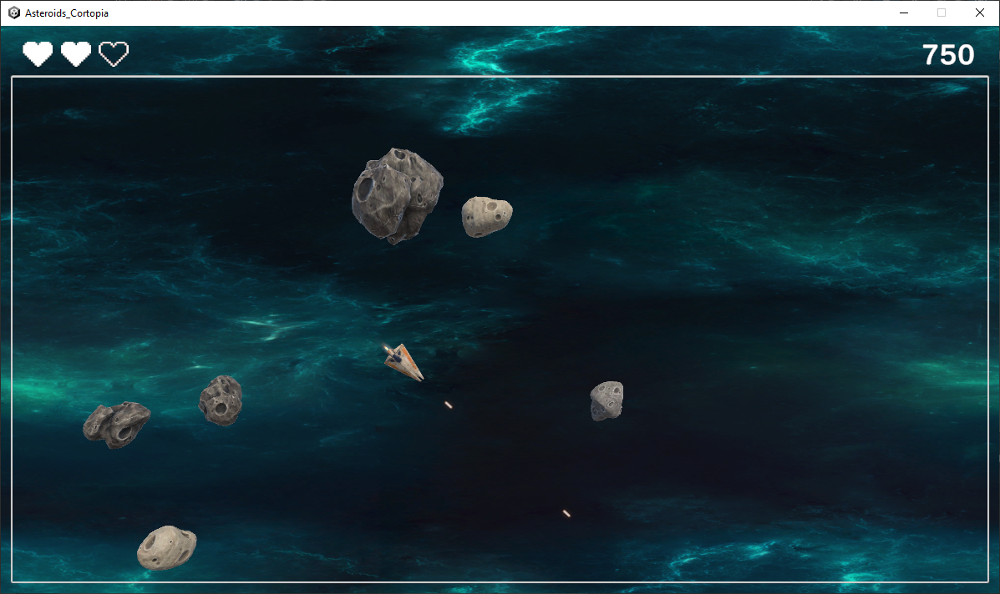

# Cortopia Asteroids by Lyneia
A Unity3D game made by Lyneia as work test for Beyond Frames & Cortopia.

## Description

The game is based on Asteroids from 1979 with simplified rules and "modern" visuals.

## Improvement
The game can be improve with a few thing:
- Use Unity's Physics instead of own implementation of collision and gameobjects's movement
- If we don't use Physics, use quadtree to improve collision management (less collision to check each update)
- Make the game resizeable
- Improve code management
- Get Users feedback and adapt what's needed

## Credits

### Assets
Most of the assets belong to Unity Technology, there were given as example for an old tutorial.

### Sounds
In Game music by Anthox Colaboy : https://soundcloud.com/Anthox-colaboy

### References
SAT explanation https://dyn4j.org/2010/01/sat/

Usefull reading  https://www.geometrictools.com/Documentation/DynamicCollisionDetection.pdf and
https://gamedev.stackexchange.com/questions/44500/how-many-and-which-axes-to-use-for-3d-obb-collision-with-sat/

Unity Implementation of SAT
https://github.com/irixapps/Unity-Separating-Axis-SAT
